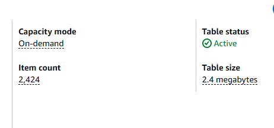
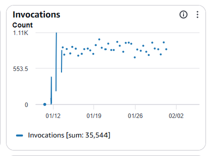
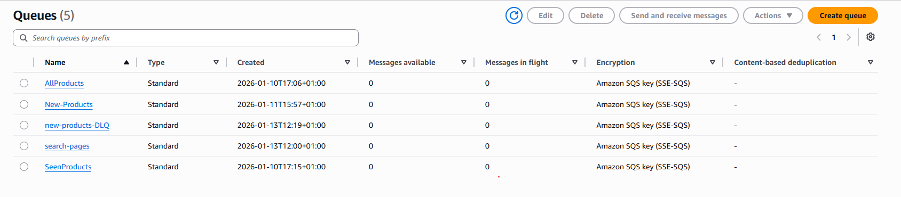
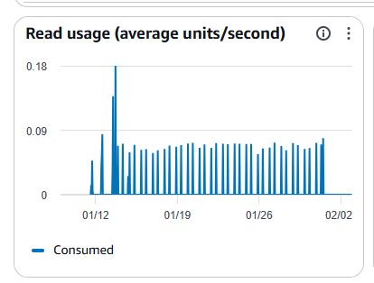
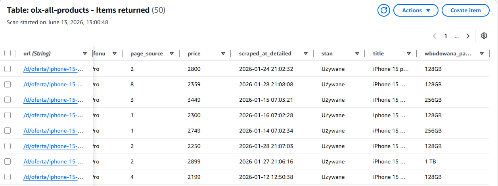

# OLX Market Analyzer 📊

An automated market intelligence pipeline built on AWS that scrapes OLX listings, 
detects price anomalies, and models how product condition factors affect resale value.

> **2,424 listings** stored in DynamoDB · **35,544 Lambda invocations** · 
> **3 weeks** of continuous automated operation · **5 SQS queues** orchestrating the pipeline

---

## 🏗️ Architecture

```
┌─────────────┐     ┌─────────────┐     ┌─────────────┐     ┌─────────────┐
│  Scheduler  │────▶│  AWS SQS    │────▶│ AWS Lambda  │────▶│   AWS S3    │
│  (trigger)  │     │  (job queue)│     │  (scraper)  │     │  (raw data) │
└─────────────┘     └─────────────┘     └─────────────┘     └─────────────┘
                                                                     │
                                                                     ▼
                                                            ┌─────────────┐
                                                            │   AWS EC2   │
                                                            │  (analysis) │
                                                            └─────────────┘
                                                                     │
                                                    ┌────────────────┼────────────────┐
                                                    ▼                ▼                ▼
                                           Anomaly Detection   Price Modeling   Category Benchmarks
```

**Flow:**
1. Scheduler triggers scraping jobs on a set interval
2. Jobs are queued via **SQS** for reliable, decoupled processing
3. **Lambda** functions execute the scraper and store raw listings to **S3**
4. **EC2** pulls data from S3 and runs the analysis pipeline
5. Outputs: anomaly flags, fair price recommendations, feature impact scores

---

## 📈 What It Analyzes

- **Price anomaly detection** — identifies listings priced significantly above or below market rate
- **Fair price recommendations** — suggests correct pricing for sellers based on comparable listings
- **Feature impact modeling** — quantifies how factors like battery condition, wear level, and accessories affect resale value
- **Category benchmarking** — compares price distributions across product categories

---

## 🛠️ Tech Stack

| Layer | Technology |
|---|---|
| Language | Python 3.11 |
| Containerization | Docker |
| Job Queue | AWS SQS |
| Compute (scraping) | AWS Lambda |
| Storage | AWS S3 |
| Compute (analysis) | AWS EC2 |
| CI/CD | GitHub Actions |

---

## 📁 Project Structure

```
olx-aws-general-scraper/
├── app/                    # Application logic
├── src/                    # Core scraping & analysis modules
├── .github/workflows/      # CI/CD pipeline
└── Dockerfile              # Container definition
```

---

## 🚀 Getting Started

### Prerequisites
- Python 3.11+
- Docker
- AWS account with configured credentials (`aws configure`)
- IAM permissions: SQS, S3, Lambda, EC2

### Environment Variables

```bash
AWS_ACCESS_KEY_ID=your_key
AWS_SECRET_ACCESS_KEY=your_secret
AWS_REGION=eu-central-1
S3_BUCKET_NAME=your_bucket
SQS_QUEUE_URL=your_queue_url
```

### Run locally with Docker

```bash
git clone https://github.com/NatanielSlo/olx-aws-general-scraper
cd olx-aws-general-scraper
docker build -t olx-scraper .
docker run --env-file .env olx-scraper
```

---

## 📊 Results

**35,544 Lambda invocations** over 3 weeks of continuous operation
**2,424 listings** stored in DynamoDB across multiple product categories

### AWS Infrastructure










---

## 📌 Key Design Decisions

- **SQS over direct invocation** — decouples scraping trigger from execution, provides retry logic and fault tolerance
- **Lambda for scraping** — serverless keeps costs near zero for periodic workloads
- **EC2 for analysis** — heavier computation benefits from persistent memory and faster I/O than Lambda
- **S3 as data lake** — raw data preserved separately from analysis, enabling re-analysis without re-scraping

---

## 👤 Author

**Nataniel** — [GitHub](https://github.com/NatanielSlo) · [LinkedIn](https://linkedin.com/in/yourprofile)
